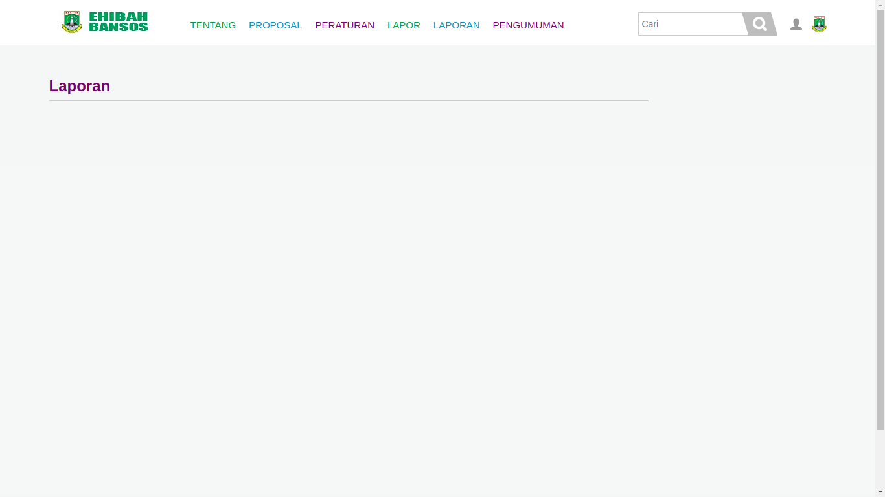
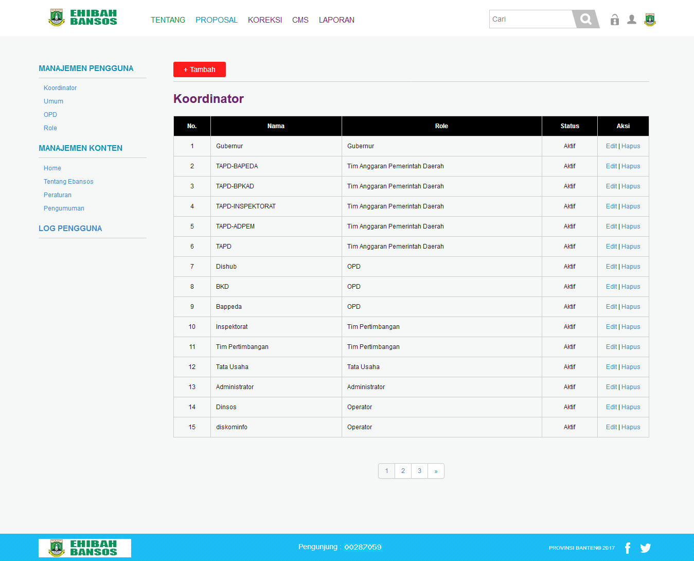

## Daftar Isi
* Will be replaced with the ToC, excluding the "Contents" header
{:toc}

E-hibahbansos adalah aplikasi yang berbasis web yang akan dipakai oleh setiap golongan masyarakat dan pihak terkait berhubungan dengan pengajuan dana hibah dan bantuan sosial dan proses-proses yang terdapat untuk mencairkan dana hibah atau bansos.
Deskripsi Umum kebutuhan aplikasi yang akan diimplementasikan meliputi semua informasi yang bersifat teknis dan menjadi acuan dalam pengembangan apliksi.

Berikut ini adalah tampilan - tampilan yang terdapat didalam apliaksi E-hibahbansos:

## 1. Tampilan Awal E-hibahbansos

Pada saat membuka aplikasi maka *user* akan ditampilkan halaman awal aplikasi yang berisikan mengenai info-info mengenai aplikasi E-hibahbansos.

### 1.1 Tampilan Tentang

Pada modul TENTANG ini *user* dapat mengetahui informasi mengenai aplikasi E-hibahbansos seperti apa itu e-hibahbansos, tujuan dan tahapan-tahapan yang terdapat di dalam aplikasi E-hibahbansos.

### 1.2 Proposal

Pada modul PROPOSAL ini *user* dapat melihat proposal-proposal yang sudah terinput kedalam apliaksi E-hibahbansos dan sudah berada pada tahapan mana proposal tersebut yang ditunjukan dengan angka 1 sampai 7 pada proposal tersebut.

### 1.3 Peraturan

Pada modul PERATURAN ini *user* dapat melihat peraturan-peraturan yang menjadi dasar dalam pembuatan aplikasi E-hibahbansos.

### 1.4 Lapor

Pada modul LAPOR ini *user* dapat membuat pelaporan mengenai kendala atau masalah yang dihadapi oleh *user* dalam penggunaan aplikasi.

### 1.5 Laporan

Pada modul LAPORAN ini *user* dapat melihat laporan-laporan yang telah dikirim oleh *user* kedalam aplikasi.

### 1.6 Pengumuman

Pada modul PENGUMUMAN ini *user* dapat melihat pengumuman yang  dikeluarkan oleh operator E-hibahbansos.

### 1.7 Login

Tampilan login ini berisikan 2 *field* yang harus diisi oleh *user* untuk masuk sebagai akun yang diinginkan.

### 1.8 Registrasi

Modul REGISTRASI ini digunakan untuk pendaftar yang belum memiliki akun E-hibahbansos.

## 2. Tampilan Superadmin

### 2.1 Tampilan Awal Superadmin

Tampilan awal superadmin ini dapat diakses ketika *user* login dengan id dan password superadmin. didalam tampilan ini terdapat beberapa modul seperti Koreksi, CMS dan Laporan

### 2.2 Tampilan Koreksi

Modul Koreksi ini dapat diakses oleh superadmin dengan cara mengklik tulisan "koreksi" di bagian atas aplikasi. Modul ini dapat digunakan untuk mengkoreksi data alur kegiatan E-hibahbansos

### 2.3 Tampilan CMS (Content Management System)

Modul CMS ini dapat diakses dengan mengklik tulisan "CMS" dibagian atas aplikasi. Modul CMS ini digunakan untuk mengatur konten-konten yang terdapat diaplikasi seperti Manajemen Pengguna, Manajemen Konten dan Log Pengguna.

### 2.4 Tampilan Laporan

Modul Laporan ini dapat diakses dengan cara mengklik tulisan "Laporan" pada bagian atas aplikasi. Didalam modul ini superadmin dapat melihat laporan mengenai proposal yang telah diproses di aplikasi E-hibahbansos.

## 3. Tampilan Pendaftar

